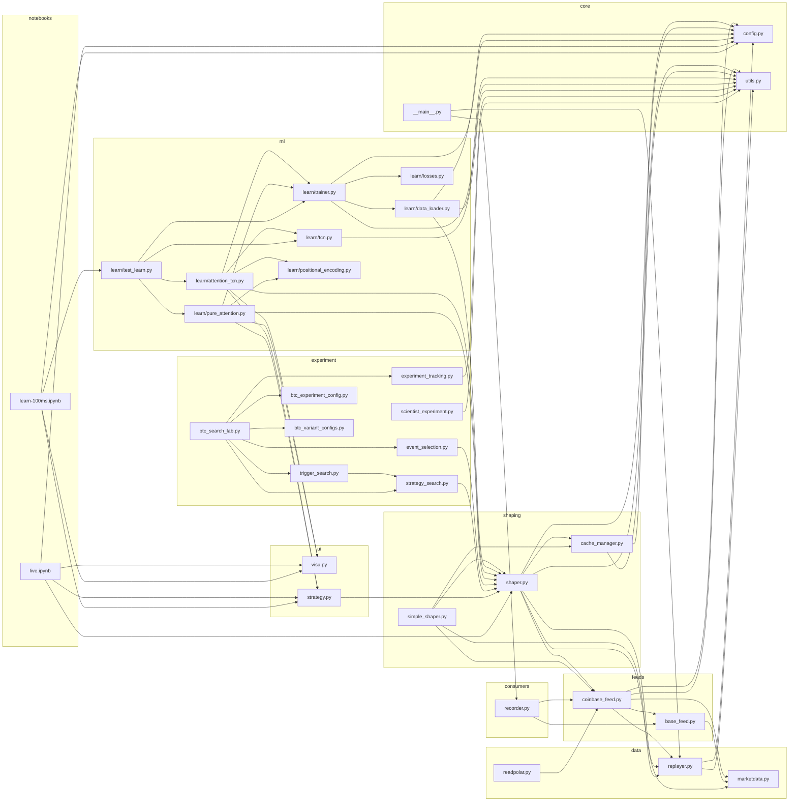
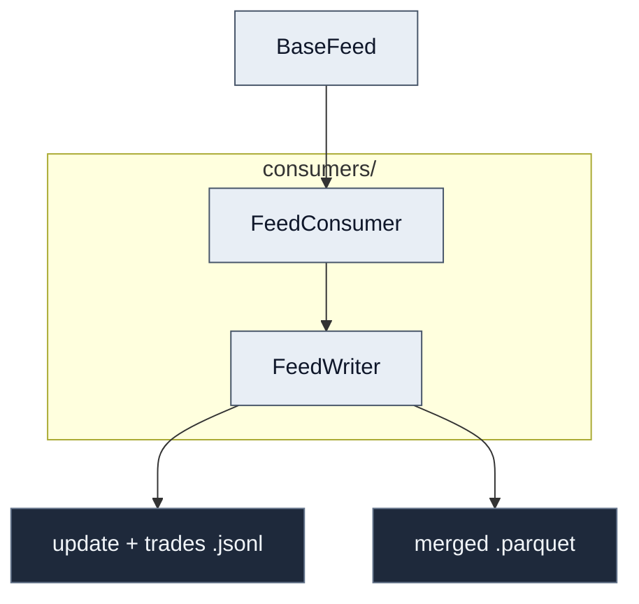

# deep_orderbook — Architecture Map

> Concept: image-to-image forecasting — 2D order-book tensor (time × price levels) → 2D time-to-level proximity tensor.
> Model trains on historical parquet, evaluates live via Coinbase WebSocket.

---

## Dependency Diagram

---

## File Map

### `deep_orderbook/` — core package

- **`__main__.py`** — CLI entry point (`deepbook record|replay`)
  - `main()` — argparse dispatch to recorder/replayer

- **`config.py`** — all Pydantic config models; no internal imports
  - `FeedConfig`, `ReplayConfig.file_list()`, `ShaperConfig`, `TrainConfig`, `CacheConfig`, `Fullconfig`
  - `BaseConfig.but()` — copy-with-overrides pattern used everywhere

- **`utils.py`** — logging setup, global `logger`, `conf` singleton
  - `make_handlers()`, `make_logger()`

- **`marketdata.py`** — domain types for order book + trade data
  - `DepthCachePlus` — per-symbol in-memory book, emits `OneSecondEnds` snapshots
  - `OneSecondEnds` — BBO, avg price, aggregated trades for one second window
  - `MulitSymbolOneSecondEnds.make_one_second()` — multi-symbol snapshot

- **`replayer.py`** — polars-backed parquet replay, acts as `CoinbaseFeed` backend
  - `ParquetReplayer` — drives file-by-file replay with `subscribe_async`
  - `EndReplay` — sentinel signalling end of recorded data

- **`shaper.py`** — converts `OneSecondEnds` into 3D numpy tensors (time × price × features)
  - `ArrayShaper.make_arr3d()` — bin book levels into image columns
  - `ArrayShaper.build_time_level_trade()` — compute time-to-level proximity targets
  - `iter_shapes_t2l()` — main async generator: cache-first, falls back to live feed

- **`simple_shaper.py`** — simpler single-feature variant of shaper
  - `SimpleShaper` — single book-pressure feature + forward-return targets
  - `iter_shapes_t2l()` — same signature as `shaper.py`

- **`cache_manager.py`** — `.npz` on-disk cache keyed by config hash
  - `ArrayCache.load_cached()` / `save_to_cache()` — param-keyed file lookup
  - `ArrayCollector.cache_arrays()` — flush a parquet file's worth of arrays

- **`strategy.py`** — rule-based position logic over proximity maps
  - `Strategy.compute_pnl()` — entry/exit signals → simulated PnL vs bid/ask
  - `Strategy.compute_proximities()` — extract up/down proximity from target map

- **`visu.py`** — Plotly live dashboard (6-subplot figure)
  - `Visualizer.update()` — push new arrays into all subplots
  - `Visualizer.add_loss()` — append training/test loss for loss subplot
  - `_widget_env()` — detects JupyterLab vs Cursor; picks FigureWidget vs go.Figure

- **`readpolar.py`** — offline NDJSON → parquet tooling
  - `resort_by_ts()`, `merge()`, `main()` — local data prep scripts

---

### `deep_orderbook/feeds/`
> WebSocket / replay message pipeline; normalises raw exchange events into `marketdata` types.

- **`base_feed.py`** — abstract async feed interface
  - `BaseFeed` — async iterator over `MulitSymbolOneSecondEnds`
  - `EndFeed` — sentinel

- **`coinbase_feed.py`** — Coinbase Advanced Trade WS client or parquet replay backend
  - `CoinbaseFeed.one_second_iterator()` — main data loop; yields `MulitSymbolOneSecondEnds`
  - `CoinbaseFeed.polarize()` / `depolarize()` — NDJSON ↔ parquet conversion
  - `CoinbaseFeed._on_message()` / `process_message()` — WS message routing

---

### `deep_orderbook/consumers/`
> Async writers that subscribe to a `BaseFeed`, persist raw JSONL, and fold it into parquet through the feed’s `polarize` pipeline.

*Last updated (this subsection): 2026-04-17*

- **`recorder.py`** — `FeedWriter` context manager: opens paired JSONL files, async loop filters subscription noise and appends book vs trade lines; on exit closes the feed queue, closes files, runs `post_process_file()` (Polars string cache, `feed.polarize` for each stream, `merge_sorted` by timestamp, write parquet, delete JSONL)
  - `FeedConsumer` — shared `feed` handle; `sleep_until_next_hour()` / `sleep_until_midnight()` for scheduled gaps between capture windows
  - `FeedWriter.start_recording()` / `_write_messages()` — background task driving the async iterator over `feed`
  - `FeedWriter.post_process_file()` — NDJSON → typed columns → single parquet artifact

---

### `deep_orderbook/learn/`
> PyTorch training pipeline: data loading → model → loss → checkpoint.

- **`data_loader.py`** — background thread running `iter_shapes_t2l` into a queue
  - `DataLoaderWorker.start()` / `stop()` / `run()`

- **`trainer.py`** — training loop, checkpointing, test evaluation
  - `Trainer.train_step()` — one batch forward+backward
  - `Trainer.compute_test_loss()` / `predict()`
  - `Trainer.load_latest_checkpoint()` / `save_checkpoint()`

- **`losses.py`** — structured time-to-level loss
  - `StructuredT2LLoss.forward()` — pointwise + up/down ranking + monotonicity terms

- **`tcn.py`** — dilated 2D temporal convolutional network
  - `TCNModel`, `ResidualBlock`

- **`attention_tcn.py`** — TCN + per-price-level causal multi-head attention
  - `AttentionTCN.forward()`
  - `train_and_predict()` — async generator for notebook training loop

- **`pure_attention.py`** — Conv1×1 → TransformerEncoder architecture
  - `TimeSeriesTransformer.forward()`
  - `train_and_predict()` — same interface as `attention_tcn`

- **`positional_encoding.py`** — sinusoidal positional encoding
  - `PositionalEncoding.forward()`

- **`test_learn.py`** — notebook-facing `train_and_predict` dispatcher
  - `train_and_predict()` — wraps all three model variants, selected by config

---

### `deep_orderbook/` — experiment tooling

- **`experiment_tracking.py`** — SQLite experiment registry + PNG preview export
  - `register_experiment_run()` — upserts run metadata/metrics into `experiments.db`
  - `save_map_preview()` — renders a numpy array as a PNG for experiment comparison

- **`scientist_experiment.py`** — helpers for choosing data and gating experiments
  - `choose_latest_parquet()` — picks the most recent parquet file from the data dir
  - `richness_gate()` — checks dataset has enough rows before running an experiment

- **`event_selection.py`** — leakage-safe window ranking by observable market eventfulness
  - `score_window_eventfulness()` — composite score from return, range, vol, book std, impulse
  - `rank_eventful_windows()` — sort all windows by eventfulness score
  - `select_eventful_window_indices()` — pick top-N% windows for focused training

- **`strategy_search.py`** — vectorized directional strategy backtester over predicted maps
  - `build_signal_features()` — extract up/down max and margin from prediction map
  - `evaluate_long_strategy()` / `evaluate_short_strategy()` — simulate PnL with entry/exit/persistence/cooldown logic

- **`trigger_search.py`** — train-calibrated strategy grid generator + scoring
  - `build_train_calibrated_strategy_grid()` — generate 10 strategy parameter sets from train-data quantiles
  - `score_strategy_result()` — composite PnL + precision + F1 + market-time-penalty score

- **`btc_search_lab.py`** — image quality metrics and holdout route ranking
  - `compute_png_quality_stats()` — PNG image QC (contrast, edge density, saturation)
  - `score_holdout_route()` — composite precision + F1 + image + RMSE score for ranking variants
  - `rank_variant_results()` — sort all variant results by route score

- **`btc_variant_configs.py`** — named parameter grid for BTC batch experiments
  - `BATCH_VARIANTS` — 25+ named variant dicts covering loss/epochs/width/threshold combinations
  - `EVENT_FILTERED_SUITE_25` — curated 25-variant list for event-filtered runs
  - `get_batch_variant()` — retrieve a variant config by name

- **`btc_experiment_config.py`** — shared BTC experiment setup (file lists, split definitions)

---

### `scripts/` — numbered experiments

Each script is a self-contained scientific experiment using `iter_shapes_t2l` shaped windows.

- **`exp01`** — inspect target tensor structure from shaped windows
- **`exp02`** — Ridge predictive power screen vs baselines
- **`exp03_nonlinear`** — nonlinear/sparse sklearn model comparison
- **`exp03_tcn`** — tiny TCN + sparse/event loss metrics
- **`exp04`** — multi-horizon screening with gradient boosting
- **`exp05`** — baseline vs structured-loss TCN; logs to `experiment_tracking` DB
- **`exp06`** — hurdle-style classifier+regressor maps on shaped data
- **`exp07`** — long-horizon sweep with post-filtering heuristics
- **`exp08`** — purged train/test splits + hurdle analysis
- **`exp10`** — one-shot scientist protocol: richness gate → train → dashboard → DB
- **`exp16_batch_h64_tcn.py`** — 12-variant BTC TCN grid search with image QC
- **`exp10_scientist_once.py`** — end-to-end scientist protocol runner
- **`hourly_experiment_cycle.py`** — scheduled loop over horizons with sklearn metrics
- **`soundness_audit_overlap.py`** — audit leakage between train/test window hashes
- **`replay_readme_style_prediction.py`** / **`sim_data_prediction_snapshot.py`** — demo/README-style prediction plots

---

### `tests/`

- **`test_experiment_tracking.py`** — tests for SQLite registration and PNG export
- **`test_scientist_experiment.py`** — tests for `choose_latest_parquet` / `richness_gate`
- **`test_structured_loss.py`** — tests for `StructuredT2LLoss` and trainer criterion wiring
- **`test_receiver.py`** — async integration: `CoinbaseFeed` → shaper
- **`test_replayer.py`** — `ParquetReplayer` creation tests

---

## Quick Reference

- **Live market data** → `feeds/coinbase_feed.py` → `CoinbaseFeed`
- **Replay recorded data** → `replayer.py` → `ParquetReplayer`
- **Record live data** → `consumers/recorder.py` → `FeedWriter`
- **Book → tensor conversion** → `shaper.py` → `ArrayShaper` / `iter_shapes_t2l`
- **Cache precomputed tensors** → `cache_manager.py` → `ArrayCache`
- **Config for anything** → `config.py` → `FeedConfig / ReplayConfig / ShaperConfig / TrainConfig`
- **Train a model** → `learn/trainer.py` → `Trainer`
- **Swap model architecture** → `learn/test_learn.py` → `train_and_predict()`
- **Loss function** → `learn/losses.py` → `StructuredT2LLoss`
- **Live notebook** → `live.ipynb` (live feed + strategy)
- **Training notebook** → `learn-100ms.ipynb` (replay + ML)
- **Visualise anything** → `visu.py` → `Visualizer`
- **Rule-based PnL** → `strategy.py` → `Strategy.compute_pnl()`
- **CLI** → `__main__.py` → `deepbook record|replay`
- **Track experiment results** → `experiment_tracking.py` → `register_experiment_run()`
- **Pick data for experiment** → `scientist_experiment.py` → `choose_latest_parquet()` / `richness_gate()`
- **Event-filter windows** → `event_selection.py` → `select_eventful_window_indices()`
- **Backtest strategy** → `strategy_search.py` → `evaluate_long_strategy()`
- **Calibrate triggers** → `trigger_search.py` → `build_train_calibrated_strategy_grid()`
- **Rank experiment routes** → `btc_search_lab.py` → `rank_variant_results()`
- **BTC variant grid** → `btc_variant_configs.py` → `BATCH_VARIANTS`
- **Run a numbered experiment** → `scripts/exp0N_*.py`
