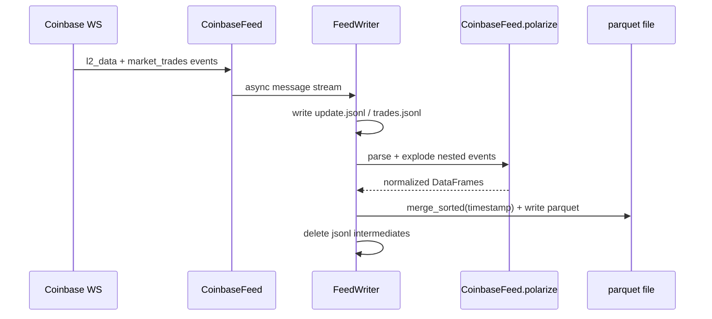
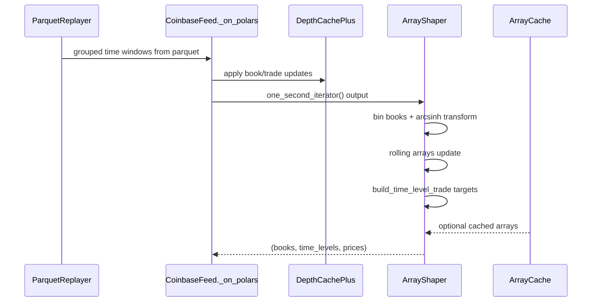
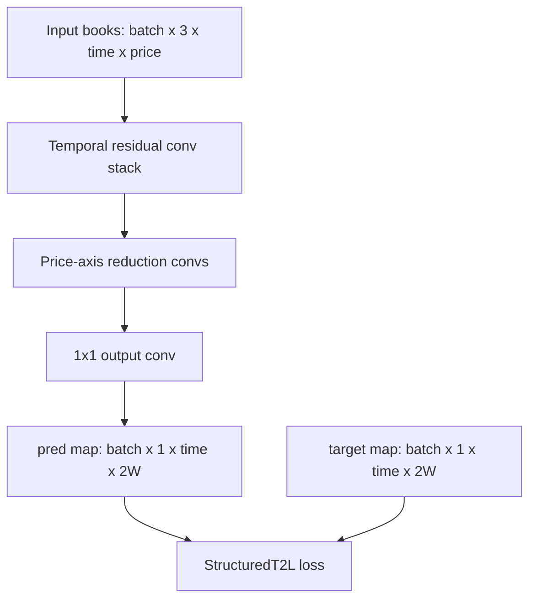

# Deep OrderBook — Current Architecture (as implemented)

This is the runtime architecture in code today.

## 1) End-to-end map

```mermaid
flowchart LR
  A[Coinbase Websocket / Parquet Replay] --> B[CoinbaseFeed]
  B --> C[DepthCachePlus per symbol]
  B --> D[Per-second snapshot: MulitSymbolOneSecondEnds]
  D --> E[ArrayShaper.make_arr3d]
  E --> F[books tensor T x 2L x 3]
  E --> G[prices tensor T x 2]
  G --> H[build_time_level_trade]
  H --> I[target tensor T x 2W x 1 (5 / time_to_cross)]
  F --> J[Trainer + CNN/TCN]
  I --> J
  J --> K[predicted proximity tensor T x 2W x 1]
  K --> L[Strategy / PnL logic]
```

Legend:
- L = num_side_lvl
- W = look_ahead_side_width
- T = rolling_window_size (or shorter if partial windows allowed)

## 2) Live ingestion and storage path



Code anchors:
- deep_orderbook/consumers/recorder.py
- deep_orderbook/feeds/coinbase_feed.py

## 3) Replay and shaping path



Code anchors:
- deep_orderbook/replayer.py
- deep_orderbook/shaper.py
- deep_orderbook/cache_manager.py

## 4) Model/training path (image-to-image style)



Notes:
- This is Conv2d over (time, price), i.e. image-to-image style forecasting.
- Target is a field, not a scalar class.
- The right half of levels is upside; left half is downside.

## 5) Target semantics

`build_time_level_trade()` computes crossing-time-derived proximity values.

- First half of level axis: downward side (`timeDn` reversed)
- Second half: upward side (`timeUp`)
- Higher value = sooner expected crossing

Interpretation aligned with intended usage:
- each training/inference step is a "now"
- map encodes what happens after that now across level directions

## 6) New loss/training improvements now in code

Added:
- `deep_orderbook/learn/losses.py::StructuredT2LLoss`
- trainer criterion factory now supports `criterion="StructuredT2L"`
- optional focus on actionable final row via `loss_focus_last_step=True`

This preserves the full map while improving directional and structural supervision.

## 7) Known runtime blockers still present

1) `deepbook record` works via `deep_orderbook.__main__`.
2) `deepbook-record` direct async entry script wiring can still be fragile.
3) `replay` demo main hard-imports `pyinstrument` and fails if missing.
4) Several mutable defaults remain in marketdata models.
