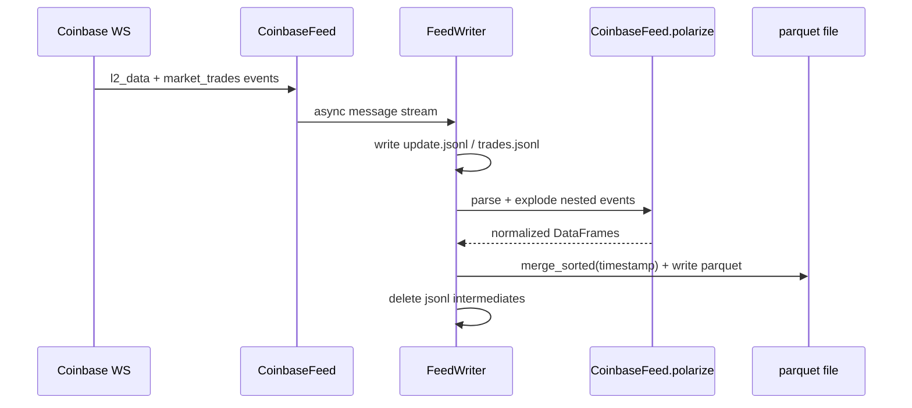
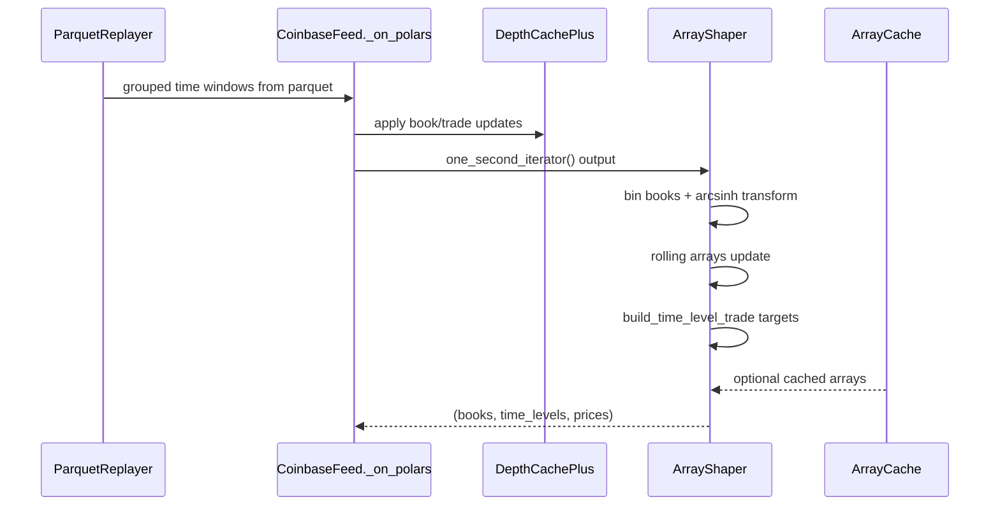
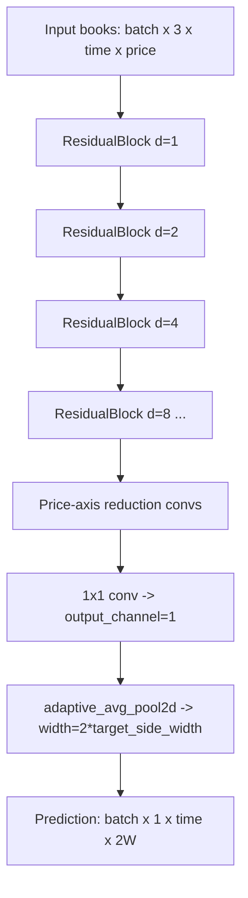

# Deep OrderBook — Current Architecture (as implemented)

This is the actual runtime architecture in code today (not aspirational docs).

## 1) End-to-end map

```mermaid
flowchart LR
  A[Coinbase Websocket / Parquet Replay] --> B[CoinbaseFeed]
  B --> C[DepthCachePlus per symbol]
  B --> D[Per-second snapshot: MulitSymbolOneSecondEnds]
  D --> E[ArrayShaper.make_arr3d]
  E --> F[books tensor T x 2L x 3]
  E --> G[prices tensor T x 2]
  G --> H[build_time_level_trade]
  H --> I[target tensor T x 2W x 1 (5 / time_to_cross)]
  F --> J[Trainer + TCNModel]
  I --> J
  J --> K[predicted proximity tensor T x 2W x 1]
  K --> L[Strategy / PnL logic]
```

Legend:
- L = num_side_lvl
- W = look_ahead_side_width
- T = rolling_window_size (or shorter if partial windows allowed)

## 2) Live ingestion and storage path



Code anchors:
- deep_orderbook/consumers/recorder.py
- deep_orderbook/feeds/coinbase_feed.py

## 3) Replay and shaping path



Code anchors:
- deep_orderbook/replayer.py
- deep_orderbook/shaper.py
- deep_orderbook/cache_manager.py

## 4) Model/training path (CNN/TCN)



Notes:
- This is a temporal convolutional network implemented as Conv2d over (time, price).
- Causality is approximated by left-padding on time axis in residual blocks.

Code anchors:
- deep_orderbook/learn/tcn.py
- deep_orderbook/learn/trainer.py

## 5) Target semantics (what the model predicts)

`build_time_level_trade()` computes future crossing times, then returns `5 / time_to_cross`.

- First half of channel axis: downward side (`timeDn` reversed)
- Second half: upward side (`timeUp`)  ← this is the “right side” in your image interpretation

So higher values mean nearer/sooner crossing.

## 6) Known runtime mismatches/blockers in current repo

1) `deepbook record` works via `deep_orderbook.__main__`.
2) `deepbook-record` entry script is miswired if mapped directly to async main.
3) `replay` path currently hard-imports `pyinstrument` in `main()` and fails if missing.
4) Several mutable defaults exist in models (`{}` / `[]`) in marketdata.py and can leak state across instances.

## 7) What is live vs research code

Live-ish path:
- CoinbaseFeed + recorder + parquet replay + shaper + trainer/strategy loop.

Research / exploratory path:
- notebooks and `main()` demo blocks with hardcoded paths.
