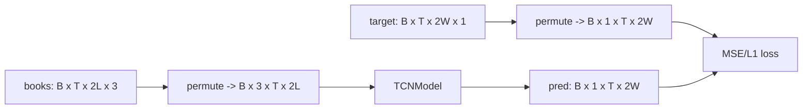

# Deep OrderBook — Prediction/Target Architecture (time-to-level)

## 1) Label construction logic

```mermaid
flowchart TD
  A[prices array: T x 2 (bid, ask)] --> B[Define FUTURE horizon]
  B --> C[Build ask/bid future windows via sliding_window_view]
  C --> D[Compute up thresholds from ask]
  C --> E[Compute down thresholds from bid]
  D --> F[tradeUp: future bid >= ask+threshold]
  E --> G[tradeDn: future ask <= bid-threshold]
  F --> H[first hit index => timeUp]
  G --> I[first hit index => timeDn]
  H --> J[distance scaling by threshold]
  I --> J
  J --> K[concat(timeDn reversed, timeUp)]
  K --> L[proximity target = 5 / time2levels]
```

Output:
- target shape = `T x (2*look_ahead_side_width) x 1`
- right side = upward crossings (`timeUp` section)

## 2) Critical implementation details affecting right-side quality

1) Threshold scaling currently uses last sample price only:
- `pricestep_up = abs(a[-1]) * mult`
- `pricestep_down = abs(b[-1]) * mult`

This means thresholds are global for the entire window instead of time-local.

2) Future windows are padded with edge values near the tail:
- `np.pad(..., mode='edge')`

Last `look_ahead-1` steps have artificial no-move futures, biasing targets near zero.

3) Model trains on a truncated time slice (`rolling_window_size - look_ahead` in trainer), but shaping still emits full-length targets. Inconsistent handling can leak label artifacts to evaluation if not masked consistently.

## 3) Tensor contracts used by trainer/model



Where:
- L = `num_side_lvl`
- W = `look_ahead_side_width`

## 4) Why predictions can look weak on the future-right side

Primary reasons in this codebase:
- side bips/horizon mismatch (thresholds too hard for realized volatility)
- global threshold from last price distorts earlier timesteps
- tail padding adds synthetic hard negatives
- no explicit calibration objective for tradability (only pointwise regression)

## 5) Practical input settings that improve right-side density

On your recent local sample, better right-side coverage came from either:
- smaller `look_ahead_side_bips` (e.g., 5 vs 10), or
- larger `look_ahead` (e.g., 64 vs 32)

This is exactly what you’d expect: easier level distances or more time to hit them.
