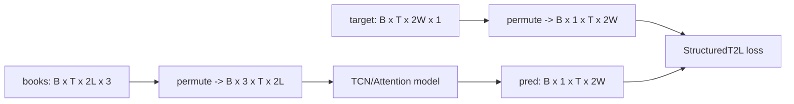

# Deep OrderBook — Prediction/Target Architecture (time-to-level map)

## 1) Core semantics (confirmed)

At each step, the model predicts a full future map from the current known state.

- Input window ends at "now".
- Output is not a single scalar; it is a 2D field over (time-position, level).
- Up and down are encoded together in one image-like tensor.

This preserves ordering/path information: if downside hits first, downside intensity dominates earlier than upside in the map.

## 2) Label construction logic (current implementation)

```mermaid
flowchart TD
  A[prices array: T x 2 (bid, ask)] --> B[Define FUTURE horizon]
  B --> C[Build ask/bid future windows via sliding_window_view]
  C --> D[Compute up/down thresholds]
  D --> E[tradeUp: future bid >= ask+threshold]
  D --> F[tradeDn: future ask <= bid-threshold]
  E --> G[first hit index => timeUp]
  F --> H[first hit index => timeDn]
  G --> I[distance scaling]
  H --> I
  I --> J[concat(timeDn reversed, timeUp)]
  J --> K[proximity target = 5 / time2levels]
```

Output contract:
- target shape = `T x (2*look_ahead_side_width) x 1`
- first half = down-side levels, second half = up-side levels

## 3) Tensor contracts used by trainer/model



## 4) New training objective added

A new `StructuredT2LLoss` now exists in `deep_orderbook/learn/losses.py`.

It keeps the full field objective (no scalar collapse) with:
1) Pointwise reconstruction term (MSE/L1 base)
2) Up-vs-down dominance ranking term
3) Level monotonicity regularizer (near levels should be more imminent than far levels)
4) Optional `focus_last_step` mode to prioritize the actionable "now" row at window end

Config knobs (TrainConfig):
- `criterion: "StructuredT2L"`
- `loss_pointwise_weight`
- `loss_updown_rank_weight`
- `loss_monotonic_weight`
- `loss_rank_margin`
- `loss_focus_last_step`

## 5) Why this matches the project idea better

- Keeps image-to-image representation (input field -> output field)
- Preserves path/order information that scalar labels lose
- Adds training pressure on directional structure, not only pixel fit
- Can prioritize final actionable row without discarding dense supervision
