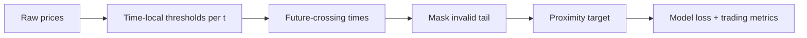
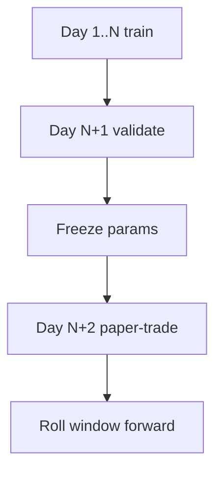

# Quant Plan — Make TTL predictions actually tradable

This is a practical plan, not generic ML advice.

## 1) Trading objective first (replace pure regression vanity)

Current loss is pointwise MSE/L1 on proximity. That does not guarantee profitable signals.

Add evaluation stack:
- hit-rate@k for top-k predicted upward levels
- precision/recall for "upside signal > threshold"
- PnL with spread + fees + cooldown
- turnover and max drawdown

Only keep model/settings that improve net PnL under costs.

## 2) Fix target construction before model iteration

Priority P0:
1. Time-local thresholds:
   - use `a[t]` / `b[t]` per t for step size, not `a[-1]`/`b[-1]`.
2. Tail masking:
   - ignore last `look_ahead-1` timesteps in loss/metrics.
3. Consistent train/eval slicing:
   - enforce same valid-index mask everywhere.

## 3) Calibrate label difficulty dynamically

Fixed bips is brittle across volatility regimes.

Use regime-adaptive distance:
- estimate short-horizon realized vol in bips
- set threshold levels as quantiles (e.g., 40/60/80th percentile move)
- keep expected positive rate in a target band (e.g., 15-35%)

That keeps right-side labels informative instead of mostly zeros.

## 4) Add microstructure features that map to short-horizon moves

You already have strong raw book/trade tensors. Add explicit channels:
- order flow imbalance (OFI)
- queue imbalance at top N levels
- spread and spread changes
- trade sign imbalance over short windows

These are low-latency, economically grounded features.

## 5) Execution-aware signal design

Do not trade raw proximity directly.

Signal candidate:
- `score = max(up_levels) - max(down_levels)`
- enter long only when score > enter_th and spread <= spread_cap
- exit when score < exit_th OR adverse down signal spikes

Use hysteresis (`enter_th > exit_th`) and cooldown to reduce churn.

## 6) Walk-forward validation (mandatory)

No random split. Use day-by-day walk-forward to avoid leakage.

## 7) Suggested immediate config sweep

Start grid:
- look_ahead: [32, 64]
- look_ahead_side_bips: [4, 5, 7, 10]
- look_ahead_side_width: [3, 4]
- threshold in strategy: [0.15, 0.2, 0.25]

Keep only configs that beat baseline after fees.

## 8) Baselines to beat

Before touching architecture, compare against:
- OFI linear model
- imbalance + spread logistic classifier
- naive momentum over midprice

If CNN/TCN cannot beat these in walk-forward net PnL, target/feature pipeline is still wrong.

## Bottom line

Your architecture direction is valid (stream -> CNN/TCN -> TTL). The blocker is target quality/calibration and execution-aware validation, not the idea of CNN itself.
