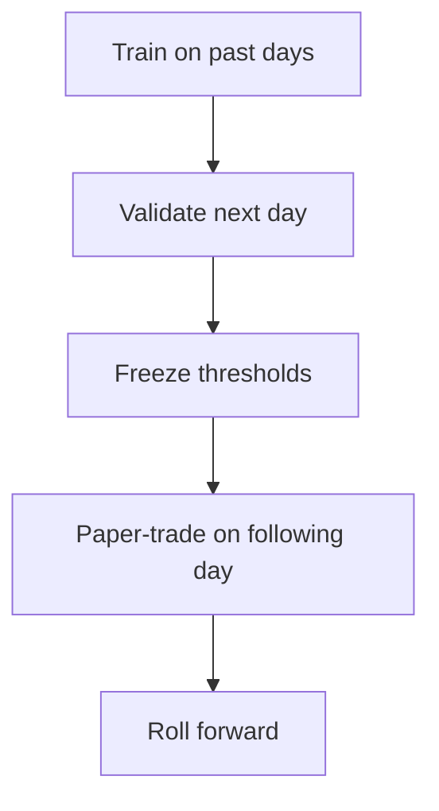

# Quant Plan — Make TTL map predictions tradable

This plan keeps the full image-to-image target.

## 1) Keep the field, don’t collapse to scalar labels

Your edge is in path/timing structure encoded in the full up/down map.

Do not replace with only "direction" or one "hit-first" scalar.
Use those as diagnostics, not primary supervision.

## 2) Training objective (implemented)

Use `StructuredT2LLoss` with three pieces:
1) Pointwise reconstruction (base MSE/L1)
2) Up-vs-down dominance ranking penalty
3) Near-vs-far monotonicity regularizer

Optional:
- `loss_focus_last_step=True` to prioritize the actionable final row (the current now at window end).

Recommended starter config:
- `criterion="StructuredT2L"`
- `loss_pointwise_weight=1.0`
- `loss_updown_rank_weight=0.25`
- `loss_monotonic_weight=0.10`
- `loss_rank_margin=0.05`
- `loss_focus_last_step=True`

## 3) Strategy should consume the full map

Instead of one scalar, use map-derived features:
- up_peak = max(up map)
- down_peak = max(down map)
- imbalance = up_peak - down_peak
- near_vs_far slope per side

Then decide enter/wait/exit with spread + fee filters.

## 4) Evaluation stack (must be trading-aware)

Keep both classes of metrics:

A) Field quality:
- map MSE/L1
- up/down dominance accuracy
- near/far ordering violations

B) Trading quality:
- net PnL after fees/slippage
- turnover
- drawdown
- time-in-market

Only accept model changes that improve B), not only A).

## 5) Validation protocol

No random shuffles across time.

## 6) Immediate next experiments

1) Compare MSELoss vs StructuredT2LLoss on same data slice.
2) Sweep `loss_updown_rank_weight` in [0.1, 0.25, 0.5].
3) Sweep `loss_monotonic_weight` in [0.0, 0.05, 0.1].
4) Compare `loss_focus_last_step` true/false for live trade quality.

## Bottom line

Your thesis stands: timing-to-level map is more useful than plain price-direction labels.
The right upgrade is better structured field loss + execution-aware evaluation, not scalar simplification.
